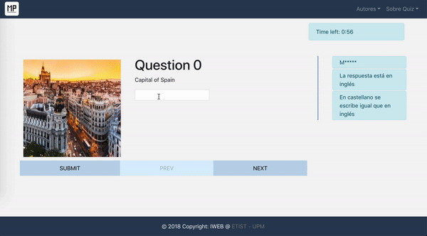

# IWEB - Project 7
##Authors
Pablo Caraballo Llorente 
Mario Penavades Suárez

## Built With
- [React JS](https://reactjs.org/)
- [React Router](https://github.com/ReactTraining/react-router)
- [Redux](https://redux.js.org/)
- [Redux Thunk](https://github.com/reduxjs/redux-thunk)

## Commands available
* `expo start` - Starts the development server in developer mode (RECOMENDED)
* `npm start` - Starts the development server in developer mode
* `npm test` - Runs all tests
* `npm run ios` - Like * `npm start`, but opens the application in an iOS simulator if you are on MAC and you have it installed
* `npm run android` - Like * `npm start`, but opens the application to a connected Android device or in an emulator. Requires Android build tools (See [React Native docs](https://facebook.github.io/react-native/docs/getting-started.html) for a more detailed installation).

## Statement
In this practice it is requested to implement a version of the [React](https://reactjs.org)-[Redux](https://es.redux.js.org) application requested in Practice 6 with the React Native framework. The implemented Native React application should work for the Android and iOS platforms (components or specific functionalities of a platform should not be used) and Redux should be used to manage the state. The application must have a suitable layout for viewing. To do this, you must define styles for the components (using the style attribute) and positioning them using Flexbox

## Requirements
Correct operation of the practice with [React Native](https://facebook.github.io/react-native/) and [Redux](https://es.redux.js.org) with the following requirements:
* Download the server questions.
* Display the questions in the web interface one at a time.
* Show the image associated with the question if you have it.
* List the tips available for each question if you have them.
* Change question by clicking on the next / back buttons.
* Allow the user to answer the questions.
* Allow the user to evaluate their answers and calculate their score.
* Develop the logic of changing the question and evaluate the answersusing [Redux](https://es.redux.js.org).
* Package the resulting application for production using theinstructions provided.

## Upgrades
* Navigation. Two screens must be created. The first screen will show only the header and a button to start the questionnaire. The second screen will show the questionnaire, to which an additional button will have to be added to return to the first screen. Navigation between the screens should be done using a StackNavigator component offered by the React Navigation library.
* Storage of questions. Three buttons must be added to the screen that shows the questionnaire:
	* Save: save the questions of the current questionnaire using the [AsyncStorage API](https://facebook.github.io/react-native/docs/asyncstorage). A single key '@ P7_2018_IWEB: quiz' must be used to store all the questions.
	* Load: Restart the questionnaire with the questions that have been previously stored. In case there is no question stored, the application should show an alert informing about it.
	* Remove: deletes previously stored questions.
	
After pressing a button, an alert should be shown indicating if the operation has been carried out successfully or if a problem has occurred.

## Demo

    

